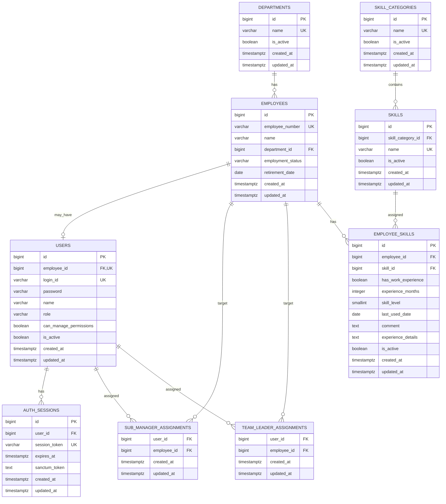

# MVP ER Diagram

## 1. 概要

MVPでは以下の領域でデータを管理する。

- Employee Management
- Access Control
- Skill Management
- Authentication

---

## 2. ER Diagram

---

## 3. Relationship

### Department → Employee

    Department 1 : N Employee

1つのDepartmentに複数Employeeが所属できる。

Employeeは1つのDepartmentに所属する。

---

### Employee → User

    Employee 1 : 0..1 User

一般社員はApplicationを利用しないため、
EmployeeにUserが存在しない場合がある。

Application利用者のみUserを持つ。

---

### User → AuthSession

    User 1 : N AuthSession

1 Userが複数Device / BrowserからLoginする可能性があるため、
複数Sessionを許可する。

---

### SubManager → Employee

    User N : M Employee

`sub_manager_assignments` を中間Tableとする。

1 SubManagerは複数Employeeを担当可能。

1 Employeeへ複数SubManagerを割当可能。

---

### TeamLeader → Employee

    User N : M Employee

`team_leader_assignments` を中間Tableとする。

1 TeamLeaderは複数Employeeを担当可能。

1 Employeeへ複数TeamLeaderを割当可能。

---

### SkillCategory → Skill

    SkillCategory 1 : N Skill

1つのSkillCategoryに複数Skillを所属させる。

---

### Employee → EmployeeSkill

    Employee 1 : N EmployeeSkill

Employeeは複数Skillを保持できる。

---

### Skill → EmployeeSkill

    Skill 1 : N EmployeeSkill

1つのSkillを複数Employeeが保持できる。

結果として、

    Employee N : M Skill

をEmployeeSkillによって表現する。

---

## 4. Domainとの対応

    Employee Management
    │
    ├── Department
    └── Employee

    Access Control
    │
    ├── User
    ├── SubManagerAssignment
    └── TeamLeaderAssignment

    Skill Management
    │
    ├── SkillCategory
    ├── Skill
    └── EmployeeSkill

    Authentication
    │
    └── AuthSession

---

## 5. ER図から省略するTable

Laravel Sanctum標準の、

    personal_access_tokens

はPolymorphic Relationを利用するInfrastructure Tableのため、
Domain中心のER図からは省略する。

Database自体には存在する。
